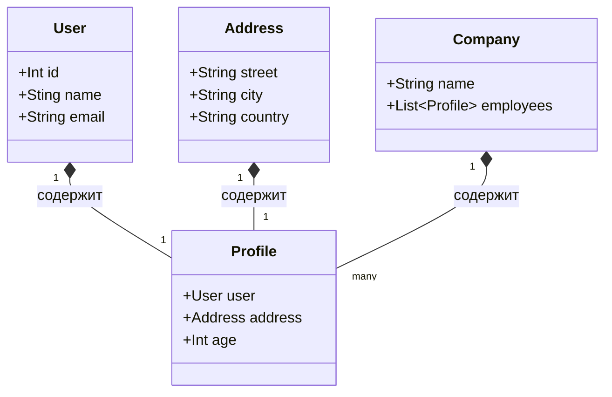

# Асинхронный сериализатор и десериализатор JSON

## Информация
Данный проект является практической работой по программированию, выданной на курсе **Kotlin FullStack Developer**

## Техническое задание
Разработать универсальный сериализатор и десериализатор для Json с использованием корутин (поля объектов должны обрабатываться асинхронно)

## Бенчмарк

### Описание структуры данных для тестирования

### Результаты

- *async* - время работы асинхронного алгоритма
- *ordinary* - время работы аналогичного алгоритма, но синхронного

Test 1

Serialize:
- async - 898
- ordinary - 180

Deserialize:
- async - 446
- ordinary - 245
-----------------------------------------
Test 2

Serialize:
- async - 101
- ordinary - 112

Deserialize:
- async - 101
- ordinary - 102
-----------------------------------------
Test 3

Serialize:
- async - 69
- ordinary - 84

Deserialize:
- async - 79
- ordinary - 100
-----------------------------------------
Test 4

Serialize:
- async - 36
- ordinary - 109

Deserialize:
- async - 58
- ordinary - 99
-----------------------------------------
Test 5

Serialize:
- async - 73
- ordinary - 81

Deserialize:
- async - 71
- ordinary - 108

## Команда
- [Воронов Александр](https://github.com/sanai1)